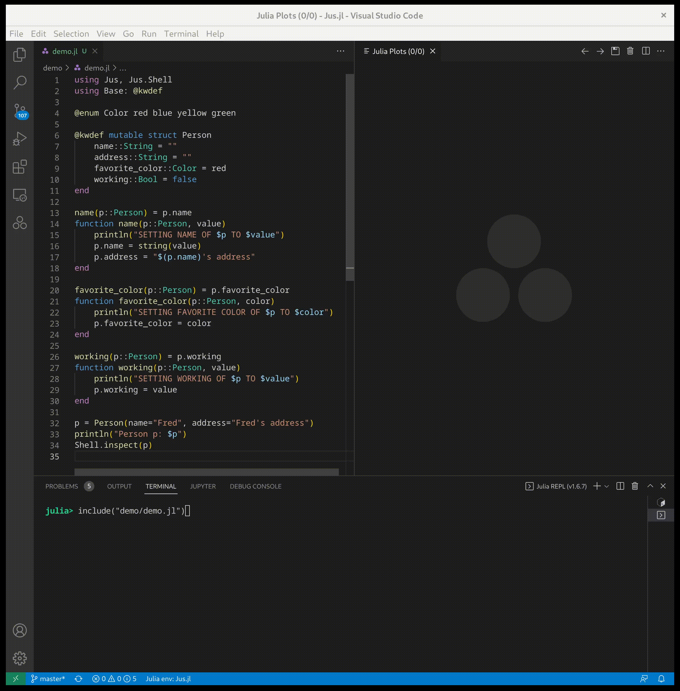

# Jus

*Jus (n): essence, juice, black coffee, electicity*

Jus is a presentation engine for Julia to support "no-code
GUIs". Its paradigm-neutral protocol allows you to frontend it with
HTML, console UIs, or even a 3D engine like Minecraft or Unreal.

# "No-code GUIs"

* Keep all your logic in Julia (not JavaScript)
* Keep all your data definitions in Julia (not duplicated in JavaScript and GraphQL)

# To run the example:

```sh
./sample 2
```

## In the VSCode REPL

Calling `Jus.Shell.inspect(data)` will pop up a GUI in the plots area.



# The HTML frontend

HTML is currently the only implmented Jus frontend but others are quite possible (see below).

For the ultimate no-code experience, Jus can mangage your entire
front-end, inferring GUIs for your data as-needed.

A frontend can be autogenerated (for the ultimate no-code experience)
or some or all of it can be entirely custom made (in HTML and CSS --
no JS required).

# Other Frontends

Frontending Jus requires an agent for that frontend. The 

- Terminal User Interface (using somethign like [this](https://github.com/kdheepak/TerminalUserInterfaces.jl)).
- Emacs
- Unreal Engine
- Network monitoring (like SNMP)
- Desktop (Gtk, Tk, FOX, etc.)
- ...
